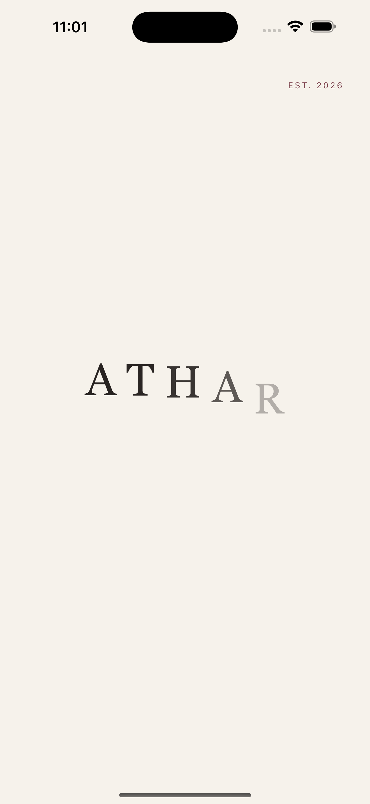
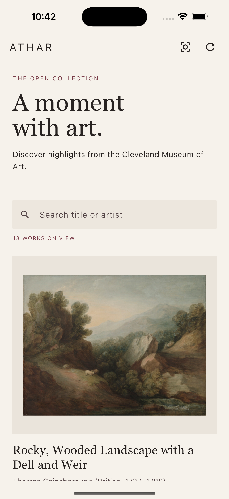
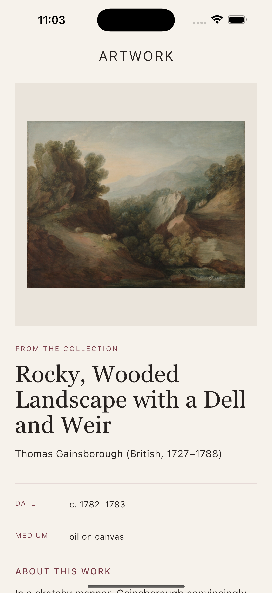
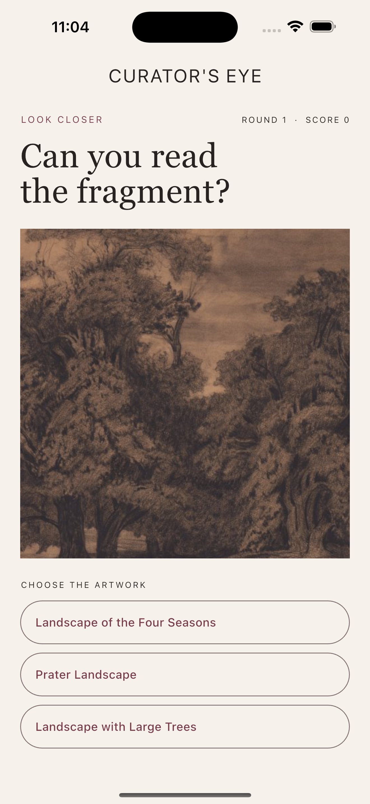

# ATHAR

ATHAR is a calm, editorial mobile museum experience built with Flutter. It
invites visitors to explore a carefully reviewed collection of landscapes from
the Cleveland Museum of Art, read each work's story, and test their observation
skills in the original **Curator's Eye** experience.

## Experience

- An animated ATHAR wordmark followed by a simple guided welcome experience.
- A searchable gallery with artwork, artist, and image data from a live API.
- A detailed artwork story loaded from a second, identifier-based endpoint.
- Curator's Eye: identify an artwork from a magnified fragment, reveal the full
  piece, track your score, and continue into its story.
- Clear loading, empty, offline, timeout, malformed-data, and retry states.
- A reviewed artwork allowlist plus metadata screening keeps the classroom
  collection free from nudity, adult themes, religious subjects, and graphic
  violence.

## API and Postman

ATHAR uses the [Cleveland Museum of Art Open Access API](https://openaccess-api.clevelandart.org/).
No API key is required. These are the two related GET requests used by the app
and tested in Postman:

```text
# 1. Gallery collection
https://openaccess-api.clevelandart.org/api/artworks/?skip=0&limit=100&q=landscape&cc0=&has_image=1&fields=id,title,creators,images,description,did_you_know,department,type,technique,culture,tombstone

# 2. Details for the selected artwork ID
https://openaccess-api.clevelandart.org/api/artworks/171296
```

The first response supplies each artwork `id`. Selecting a card passes that ID
to the second endpoint. JSON is converted to typed Dart models with
`ArtworkSummary.fromJson` and `ArtworkDetails.fromJson`.

Import [`postman/ATHAR.postman_collection.json`](postman/ATHAR.postman_collection.json)
into Postman and run the collection in order. Its tests verify both `200 OK`
responses and confirm that the details response matches the ID selected from
the gallery response.

## Project structure

```text
lib/
├── models/       Typed API response models
├── screens/      Splash, welcome, gallery, details, and Curator's Eye
├── services/     HTTP requests, parsing, errors, and content screening
├── theme/        ATHAR visual system
├── widgets/      Reusable artwork card and museum loader
└── main.dart     Application entry point
```

`FutureBuilder` drives asynchronous loading on the gallery and details screens.
The HTTP client is injectable, allowing network behavior to be tested without a
live connection.

## Run and verify

```bash
flutter pub get
flutter run
dart analyze lib test
flutter test
```

The test suite covers successful parsing, the two-endpoint flow, content
screening, loading without duplicate requests, retry behavior, HTTP failures,
offline access, timeouts, malformed responses, responsive text, and the splash
transition.

## Extra Credit

- **Curator's Eye:** an original artwork-identification game with magnified
  fragments, randomized choices, animated reveals, scoring, and a direct path
  into the artwork story.
- **Interactive onboarding:** four swipeable, picture-led slides that advance
  automatically and teach the app through visual examples.
- **Instant search:** filters the reviewed collection by title or artist.
- **Classroom-safe curation:** combines a manually reviewed ID allowlist with
  metadata screening for adult, religious, and graphic subjects.
- **Production-minded resilience:** dedicated loading animation, retry, empty,
  offline, timeout, malformed-response, and unavailable-image states.
- **Postman collection:** runnable API checks preserve the selected identifier
  between the list and details requests.

## Screenshots

### Animated splash



### Guided welcome


### Searchable gallery



### Artwork details



### Curator's Eye



## Credits

Artwork data and images are provided by the Cleveland Museum of Art Open Access
API. ATHAR only requests CC0 records with available images.
