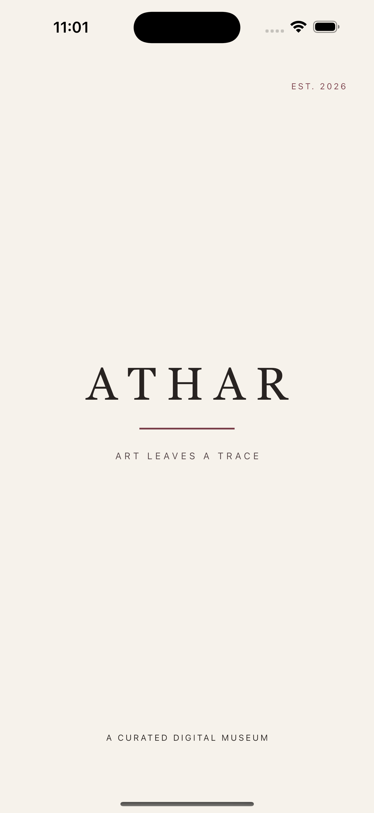
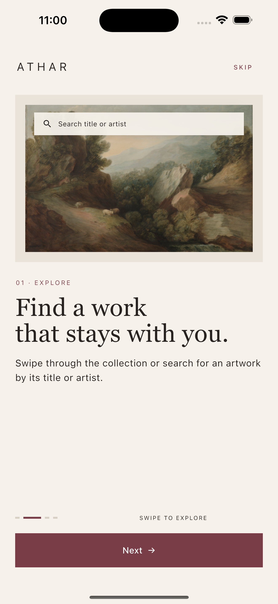
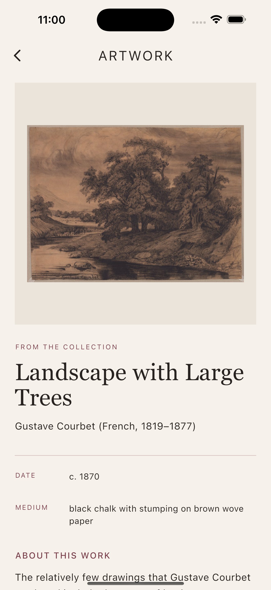
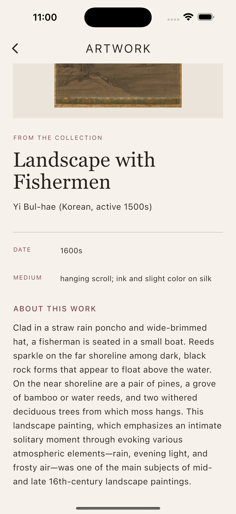
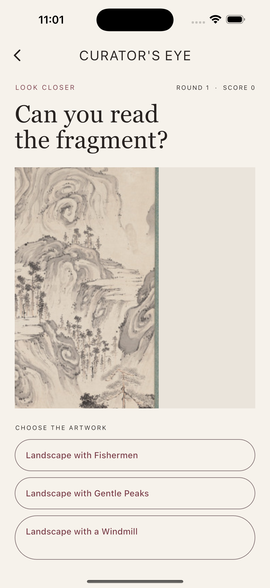
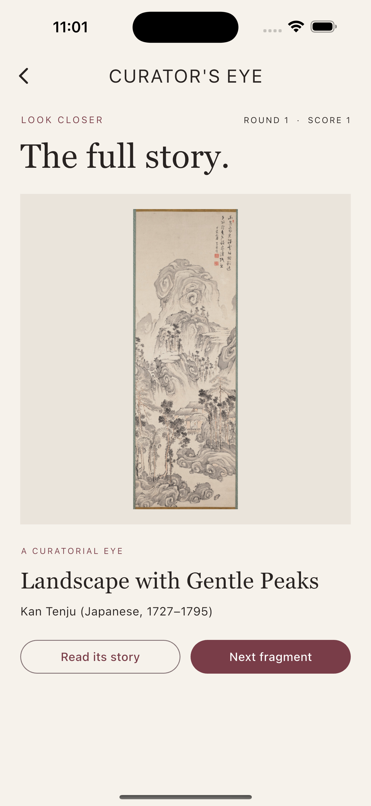

# 🖼️ ATHAR — A Curated Digital Museum

> Explore art slowly, discover the story behind each work, and train your eye
> to notice what others miss.

<p align="center">
  
  
  
  
</p>

---

## 📖 About ATHAR

**ATHAR** means *a trace*. It is a calm, editorial museum experience built with
Flutter and live open-access data from the
[Cleveland Museum of Art](https://www.clevelandart.org/open-access).

Visitors enter through an animated wordmark and a picture-led introduction,
explore a carefully reviewed landscape collection, open any work to read its
story, and test their observation skills in **Curator's Eye**.

### App journey

**Animated entrance → Guided welcome → Search the gallery → Read an artwork's
story → Play Curator's Eye**

## ✨ Features

- 🎞️ Animated ATHAR splash with staggered lettering and a soft light sweep
- 👋 Four-slide onboarding with manual swiping and automatic progression
- 🖼️ Live museum collection loaded from an external REST API
- 🔍 Instant search by artwork title or artist
- 📖 Identifier-based details request for the selected artwork
- 🎯 Curator's Eye guessing experience with fragments, choices, and scoring
- 🛡️ Manually reviewed collection with additional metadata screening
- ⏳ Custom museum loader plus clear empty, offline, timeout, and error states
- 📱 Responsive layouts tested on small screens and larger text settings
- 🧪 Injectable HTTP client with 21 automated tests

## 📱 App Walkthrough

### 1. A calm entrance

The animated wordmark introduces ATHAR, then the visual guide teaches visitors
how to explore before they enter the collection.

<p align="center">
  
  &nbsp;&nbsp;&nbsp;&nbsp;
  
</p>

<p align="center"><sub>Animated splash &nbsp;•&nbsp; Interactive onboarding</sub></p>

### 2. The open collection

A focused gallery presents reviewed artwork from the live museum API. Visitors
can search by title or artist and open any work with one tap.

<p align="center">
  
</p>

<p align="center"><sub>Live collection with instant search</sub></p>

### 3. Stories beyond the frame

The details experience combines artwork imagery with its artist, date, medium,
and museum description while preserving the catalogue-inspired layout.

<p align="center">
  
  &nbsp;&nbsp;&nbsp;&nbsp;
  
</p>

<p align="center"><sub>Artwork overview &nbsp;•&nbsp; Full museum story</sub></p>

### 4. Curator's Eye

The original fourth-screen experience turns close observation into a game:
study a fragment, choose its title, reveal the full artwork, and build a score.

<p align="center">
  
  &nbsp;&nbsp;&nbsp;&nbsp;
  
</p>

<p align="center"><sub>Fragment challenge &nbsp;•&nbsp; Full artwork reveal</sub></p>

## 🎨 Design System

ATHAR uses an **Ivory, Ink & Burgundy** palette inspired by museum catalogues.
Serif display type gives artworks an editorial presence, while restrained
spacing and geometric controls keep the interface modern.

| Token | Hex | Purpose |
|---|---|---|
| Museum Ivory | `#F6F2EB` | App background and quiet negative space |
| Gallery Ink | `#282321` | Headlines, body copy, and icons |
| Curator Burgundy | `#793D48` | Actions, labels, and progress |
| Warm Surface | `#EDE7DE` | Search, image frames, and supporting UI |

## 🔗 Two Related API Requests

ATHAR follows the required **list → selected identifier → details** pattern.
Both requests use the Cleveland Museum of Art Open Access API and require no
API key.

| Step | Request | Used for |
|---|---|---|
| 1. Collection | `GET /api/artworks/` | Loads the searchable artwork list |
| 2. Details | `GET /api/artworks/{id}` | Loads the selected artwork's full story |

The list response provides an artwork `id`. `GalleryScreen` passes that ID to
`ArtworkDetailsScreen`, which builds the second request. Responses are parsed
with `ArtworkSummary.fromJson` and `ArtworkDetails.fromJson`.

### Postman

Import [`ATHAR.postman_collection.json`](postman/ATHAR.postman_collection.json)
and run its two requests in order. The collection:

1. Verifies the gallery response returns `200 OK` and contains artwork data.
2. Saves the first response's ID as `artwork_id`.
3. Uses that variable in the details URL.
4. Confirms the returned details ID matches the selected ID.

## 🧱 Architecture

```text
lib/
├── main.dart
├── models/
│   ├── artwork_summary.dart
│   └── artwork_details.dart
├── screens/
│   ├── splash_screen.dart
│   ├── welcome_screen.dart
│   ├── gallery_screen.dart
│   ├── artwork_details_screen.dart
│   └── curators_eye_screen.dart
├── services/
│   └── artwork_service.dart
├── theme/
│   └── app_theme.dart
└── widgets/
    ├── artwork_card.dart
    ├── museum_loader.dart
    └── onboarding_artwork_visual.dart
```

- **Models** own typed JSON conversion.
- **Service** owns HTTP requests, timeouts, readable exceptions, and curation.
- **Screens** own navigation and screen-level state.
- **Widgets** keep repeated visual components focused and reusable.
- **Theme** provides one consistent visual identity.

## 🧩 Flutter Concepts Used

`FutureBuilder`, `PageView`, `ListView.separated`, `Navigator`,
`PageRouteBuilder`, `AnimatedBuilder`, `AnimatedSwitcher`,
`AnimationController`, `ShaderMask`, `Image.network`, `TextField`,
`ConstrainedBox`, `AspectRatio`, `Semantics`, and reusable custom widgets.

## 🛡️ Reliability and Curation

The app handles more than the successful API response:

- Network loss and client failures
- Slow requests with a 15-second timeout
- HTTP errors including missing and rate-limited responses
- Malformed or unexpected JSON
- Empty filtered collections
- Missing artwork images
- Retry without unnecessary duplicate requests

The classroom collection uses a manually reviewed artwork ID allowlist and a
second metadata check for adult, religious, and graphic subjects.

## 🚀 Getting Started

### Prerequisites

- Flutter SDK compatible with Dart `^3.13.1`
- iOS Simulator, Android emulator, or a physical device
- Internet connection for live museum data

### Run ATHAR

```bash
flutter pub get
flutter run
```

### Verify the project

```bash
dart analyze lib test
flutter test
```

Expected result: **no analyzer issues and 21 passing tests**.

## 🌟 Extra Credit

- **Curator's Eye** — an original fourth-screen experience with randomized
  choices, magnified fragments, animated reveals, score tracking, and direct
  navigation to the artwork story.
- **Interactive onboarding** — picture-led pages that advance automatically
  every three seconds, support gestures, and restart timing after interaction.
- **Search** — immediate client-side filtering by title and artist.
- **Content curation** — visual review plus defensive metadata screening.
- **Postman automation** — response tests and identifier chaining.
- **Accessibility and testing** — semantic image labels, responsive layout
  checks, larger-text coverage, and mocked network behavior.

## 🧠 What I Practiced

- Connecting two related REST endpoints through a selected identifier
- Modeling external JSON safely with nullable fields
- Managing asynchronous UI states with `FutureBuilder`
- Designing reusable, responsive Flutter components
- Building purposeful animation without distracting from content
- Testing successful, empty, malformed, offline, timeout, and responsive cases
- Documenting and validating an API workflow with Postman

---

<p align="center">
  Made by <strong>Turki Mohammed</strong> for Flutter Bootcamp Project 2.
</p>
